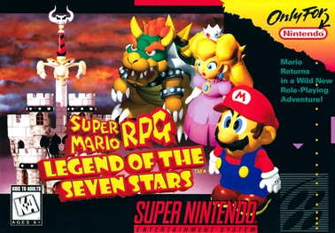

# My Favorite Game
 
Noah Wang 2024SU MTEC-340-001

## Table of Contents

- [Overview](#overview)
- [Reason of Choice](#reason-of-choice)
- [Similar Games](#similar-games)

## Overview

- My favorite game is **_Super Mario RPG: Legend of the Seven Stars_**, developed by **Square** (Now [Square Enix](https://www.square-enix.com)) and published by [Nintendo](https://www.nintendo.com) for the Super Nintendo Entertainment System on March 9, 1996.

- The game was directed by *Chihiro Fujioka* and *Yoshihiko Maekawa*, produced by *Shigeru Miyamoto*, and scored by *Yoko Shimomura*.

- Like other SNES games, it is programmed with 65c816 assembly language.

  * A remake of the game, developed in the **Unity** engine, was released for the Nintendo Switch in 2023.

- Here is the cover art of the game:
&nbsp;&nbsp;&nbsp;&nbsp;

## Reason of Choice

- The game combines elements of traditional turn-based RPGs with action-adventure mechanics.
- It has very rich and engaging story, and filled with humor.
- It introduces a lot of memorable characters.
- Because of the development in the late period of SNES, it has relatively high-quality graphics, animations, and music.
- It offers plenty of exploration, secrets, and side quests, which added depth and replayability, despite being only 4MB size.

## Similar Games
- [Chrono Trigger](https://en.wikipedia.org/wiki/Chrono_Trigger), role-playing game developed by Square, first released on SNES in 1995.
- [Secret of Mana](https://en.wikipedia.org/wiki/Secret_of_Mana), action role-playing game developed by Square, first released on SNES in 1993.
- [Paper Mario](https://en.wikipedia.org/wiki/Paper_Mario), initially revealed as a sequel of _Super Mario RPG_, developed by [Intelligent Systems](https://en.wikipedia.org/wiki/Intelligent_Systems), first released on Nintendo 64 in 2000.